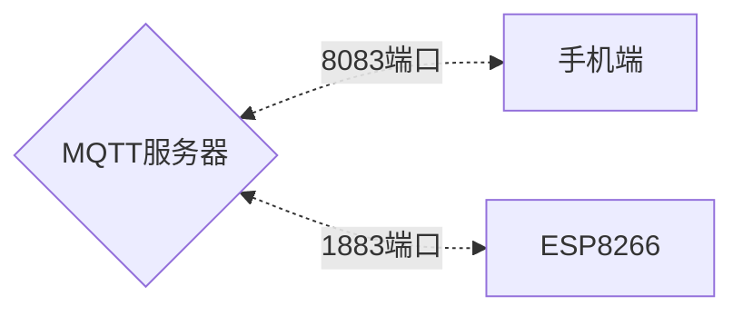
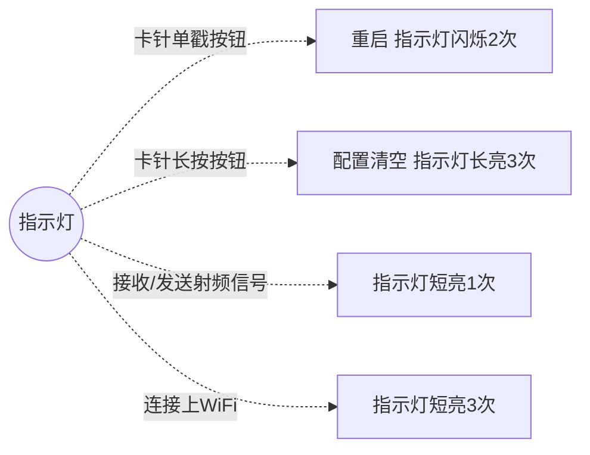
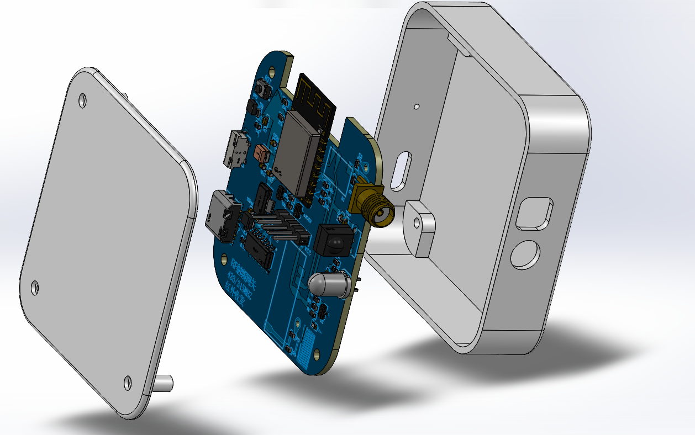
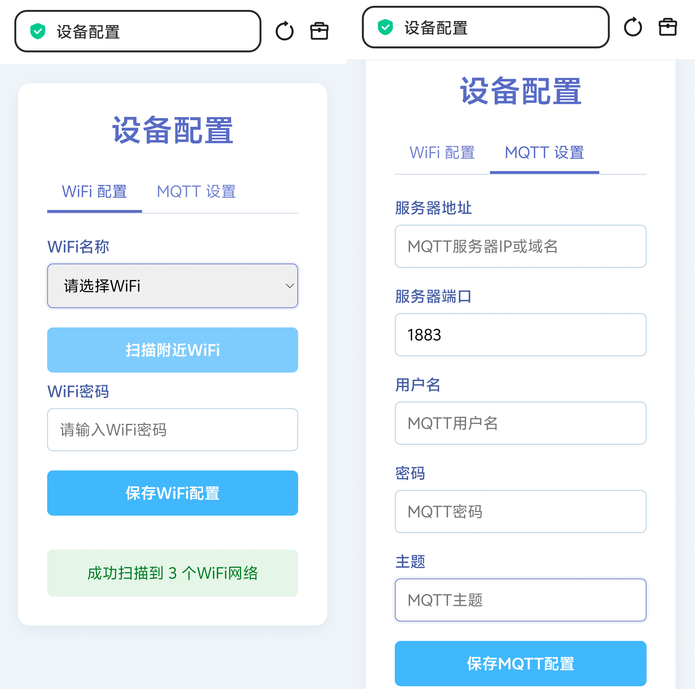

## 项目简介
**基于ESP8266的射频和红外网关**
1. 使用ESP8266-12F模组制作射频和红外网关
2. 可对433/315非加密射频信号学习与发送
3. 可对红外信息进行学习和发送
4. 因为作者~~太懒~~(想打造互联生态)所以有了本项目
> 使得以上设备可通过移动端设备进行远程控制

## 打板子注意事项
1. 板厚：**1.2mm**

## 项目架构


所有数据围绕着MQTT服务器进行的，因此你需要自己搭建一个MQTT服务器或者使用现成的MQTT服务器
### MQTT服务器架设
> 建议使用docker进行搭建，我们选择**emqx**

```shell
docker run -d --name emqx \
  -p 1883:1883 -p 8083:8083 -p 8084:8084 \
  -p 8883:8883 -p 18083:18083 \
  emqx/emqx-enterprise:latest
```
- 想静静一会就自动部署好啦🎈
- 如果是Linux记得放行端口呦
> EMQX的默认用户名是`admin`,默认密码`public`,web端口默认是`18083`


## 项目功能
> 本项目具有`自学习`，`远程控制`等特点

1. 具有测量实时温湿度功能。
2. 具有433/315信号学习。
3. 具有模拟433/315信号发送。
4. 具有红外信号学习。
5. 具有红外信号发送功能。
6. 具有指示灯。
7. 具有可重置设备的按钮。
8. 具有手机端控制功能。
9. 具有web配网

## 项目方案

1. 使用ESP8266连接路由器后建立MQTT连接实现设备上云。
2. 使用蜂鸟无线 `远-R1`实现433/315信号学习。
3. 使用蜂鸟无线 `远-T1`实现433/315信号发送。
4. 使用`IRM-3638T` 实现红外接收。
5. 使用某宝不知名品牌的`红外发射管` 实现红外发射。
6. 使用`SHT30-DIS-B10KS` 实现实时温湿度测量。


> 使用手机卡针戳type-c旁的圆孔即可实现上图1、2的操作


## 项目说明
> 简化电路
射频电路参考[RF 433 315射频网关盒子](https://oshwhub.com/yanqisui/rf-433-315-she-pin-wang-guan-he-zi)这个项目，他有说天线的问题
1. 关于天线可以都不焊接，射频接收可直接焊接0欧电阻使用板载天线，射频发射可以直接不焊接任何电阻天线之类的，因为测试过程中生活中的射频接收反而很敏感无需再焊接天线
2. 电路中的type-c旁的`二极管`可以不用焊接直接一坨锡或者0欧电阻或者直接在电路中删去
3. `AMS1117 3.3`后面的钽电容如果想省略也可直接不焊接
4. 电路板左上方的重启按钮也可省略(不是type-c旁边的那个侧贴的按钮，如果不需要物理重置功能也可以删掉，反正WiFi连接失败后会自动让你重新配网)

## 项目源码
1. 手机端APP——uni-app构建      已打包见附件
2. ESP8266端——Arduino          已编译见附件

如果自行编译ESP8266端固件需要修改`PubSubClient`库的`PubSubClient.h`源码
```cpp
#define MQTT_MAX_PACKET_SIZE 4096
```
> 因为我们的很大，它自己默认的太小了，给它~~撑大~~改一点

## 关于外壳
- 外壳是自己画的不太好看，爆炸图效果如下，但是满足嘉立创3D免费打印条件，直接~~白嫖~~免费


- 螺丝M1.6*14mm
- 螺母滚花铜螺母M1.6\*3\*2.5

## 效果图
- ESP8266配置页效果图



> 这里的服务器端口建议用默认的1883端口，MQTT主题要和软件的主题配置一致，同时建议使用用户名密码方式验证，你可以在EMQX中创建认证数据库时选择这一项

- 手机端效果图


> 注意MQTT配置的主题和ESP8266配置的主题一致即可

- 焊接成品图


## 开源声明
1. 本工具仅用于个人学习与研究，禁止任何商业用途（包括但不限于盈利性服务、企业内部使用等）
2. 不得以任何形式任何途径出售本项目提供的固件、软件、以及代码等相关资料
3. 若发现侵权或违规使用情况，请通过维护者邮箱联系，会在 3 个工作日内处理
4. 除去上述要求外，还需遵守本项目的开源协议

## 致谢
> 在以下项目中获得了本项目的灵感
1. [RF 433 315射频网关盒子](https://oshwhub.com/yanqisui/rf-433-315-she-pin-wang-guan-he-zi)
2. [墨水屏阅读器](https://oshwhub.com/jie326513988/SDka-mo-shui-ping-yue-du-qi)
3. [涂鸦_红外](https://oshwhub.com/pppw/tu-ya_-hong-wai)

## 项目信息
- 项目创建者：李先生
- 项目维护者：李先生
- 维护者邮箱：3101978435@qq.com
